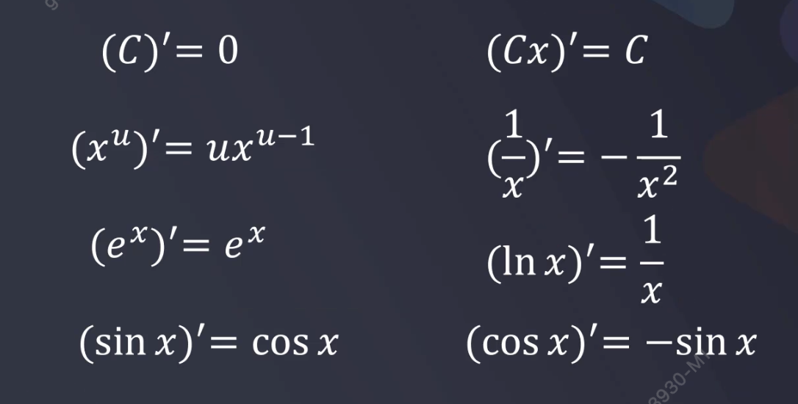
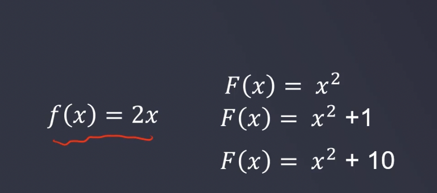
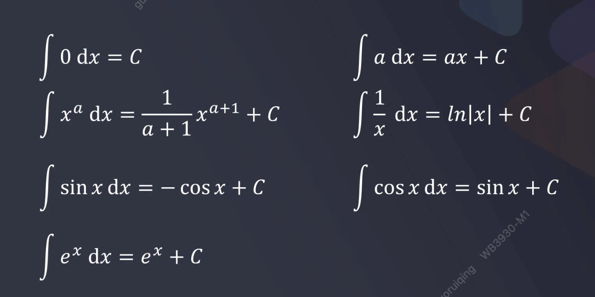

**极限的定义：**

某一个函数中的某一个变量，此变量在变大（或者变小）的过程中，逐渐向某一个确定的数值A不断地逼近的过程中，此变量的变化，被人为规定为"永远靠近而不停止"、其有一个"不断地极为靠近A点的趋势"称为极限      

$$
A = lim_{x\rightarrow{x_0}}f(x)
$$

​      当变量x无限趋近于某一个数值时，对应的函数结果

**导数：**

一个函数在某一点的导数描述了这个函数在这一点附近的变化率。

对于任意函数y=f(x),自变量x在一点x0上产生一个增量△x时，在△x趋于0时的极限，函数输出值的增量△y与自变量增量△x的比值即为函数在x0处的导数，记作:
$$
f^{'}(x_0)  或 df(x_0)/dx_0
$$

**常用导数公式：**

**导数与极值点：**

如果y  = f(x)在x = $$x_0$$的导数$$f{'}(x_0)=0$$,则$$x_0$$为该函数的一个极值点。

**导数在机器学习中的应用：梯度下降**

**积分：**

积分通常分为不定积分和定积分两种

不定积分：函数f的不定积分，是一个可导函数F且其导数等于原来的函数f，即F' = f。

定积分：对于一个给定的正实值函数f(x),由曲线、直线(x=a,x=b)以及轴围成的面积值。

函数的不定积分可以理解为其对应的反导数，有无穷多个：

**常用积分公式：**

