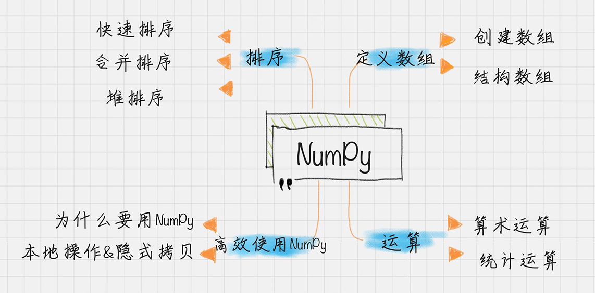

**为什么要用 NumPy 数组结构而不是 Python 本身的列表 list？**

这是因为列表 list 的元素在系统内存中是分散存储的，而 NumPy 数组存储在一个均匀连续的内存块中。这样数组计算遍历所有的元素，不像列表 list 还需要对内存地址进行查找，从而节省了计算资源。

另外在内存访问模式中，缓存会直接把字节块从 RAM 加载到 CPU 寄存器中。因为数据连续的存储在内存中，NumPy 直接利用现代 CPU 的矢量化指令计算，加载寄存器中的多个连续浮点数。另外 NumPy 中的矩阵计算可以采用多线程的方式，充分利用多核 CPU 计算资源，大大提升了计算效率。


#### ndarray对象

ndarray 实际上是多维数组的含义。

在 NumPy 数组中，维数称为秩（rank），一维数组的秩为 1，二维数组的秩为 2，以此类推。

在 NumPy 中，每一个线性的数组称为一个轴（axes），其实秩就是描述轴的数量。


#### 创建数组

```python
import numpy as np
a = np.array([1, 2, 3])
b = np.array([[1, 2, 3], [4, 5, 6], [7, 8, 9]])
print(a.shape)  //获得数组的大小   (3,)
print(b.shape)  //(3, 3)
print(a.dtype)  //获得元素的属性  int64
print(b)
```

* 可以通过函数 shape 属性获得数组的大小
* 通过 dtype 获得元素的属性
* 想对数组里的数值进行修改的话，直接赋值即可，注意下标是从 0 开始计的


#### 结构数组

如果你想统计一个班级里面学生的姓名、年龄，以及语文、英语、数学成绩该怎么办？当然你可以用数组的下标来代表不同的字段，比如下标为 0 的是姓名、下标为 1 的是年龄等，但是这样不显性。

实际上在 C 语言里，可以定义结构数组，也就是通过 struct 定义结构类型，结构中的字段占据连续的内存空间，每个结构体占用的内存大小都相同，那在 NumPy 中是怎样操作的呢？

```python
persontype  = np.dtype({
    'names':['name', 'age', 'chinese', 'math', 'english'],
    'formats':['S32', 'i', 'i', 'i', 'f']
})

peoples  = np.array([("ZhangFei", 32, 75, 100, 90),
                     ("GuanYu", 24, 85, 96, 88.5),
                     ("ZhaoYun", 28, 85, 92, 96.5),
                     ("HuangZhong", 29, 65, 85, 100)
                    ], dtype = persontype)
ages = peoples[:]['age']
chineses = peoples[:]['chinese']
maths = peoples[:]['math']
englishs = peoples[:]['english']
print(ages)
print(np.mean(ages))
print(np.mean(chineses))
print(np.mean(maths))
print(np.mean(englishs))
```

首先在 NumPy 中是用 dtype 定义的结构类型。

然后在定义数组的时候，用 array 中指定了结构数组的类型 dtype=persontype。

这样你就可以自由地使用自定义的 persontype 了。


#### ufunc运算

ufunc 是 universal function 的缩写，它能对数组中每个元素进行函数操作。


**连续数组的创建**

NumPy 可以很方便地创建连续数组，比如我使用 arange 或 linspace 函数进行创建：

```python
x1 = np.arange(1,11,2)
x2 = np.linspace(1,9,5)
```

* np.arange 和 np.linspace 起到的作用是一样的，都是创建等差数组。

* arange() 类似内置函数 range()，通过指定初始值、终值、步长来创建等差数列的一维数组，默认是不包括终值的。
* linspace 是 linear space 的缩写，代表线性等分向量的含义。linspace() 通过指定初始值、终值、元素个数来创建等差数列的一维数组，默认是包括终值的。


#### 算数运算

```python
x1 = np.arange(1,11,2)
x2 = np.linspace(1,9,5)
print np.add(x1, x2)  //加
print np.subtract(x1, x2) //减
print np.multiply(x1, x2) //乘
print np.divide(x1, x2)  //除
print np.power(x1, x2)  //n次方
print np.remainder(x1, x2) //余数
```


#### 统计函数

**计数组 / 矩阵中的最大值函数 amax()，最小值函数 amin()**

```python
a = np.array([[1,2,3],[4,5,6],[7,8,9]])
print(np.amin(a))    // 1
print(np.amin(a,0))  // [1 2 3]
print(np.amin(a,1))  // [1 4 7]
print(np.amax(a))    // 9    
print(np.amax(a,0))  // [7 8 9]
print(np.amax(a,1))  // [3 6 9]
```

* amin() 用于计算数组中的元素沿指定轴的最小值。

* 对于一个二维数组 a，amin(a) 指的是数组中全部元素的最小值。

* amin(a,0)是延着axis=0轴的最小值，axis=0轴是把元素看成了[1,4,7], [2,5,8], [3,6,9]三个元素，所以最小值为[1,2,3]。

* amin(a,1)是延着axis=1轴的最小值，axis=1轴是把元素看成了[1,2,3], [4,5,6], [7,8,9]三个元素，所以最小值为[1,4,7]。

* 同理 amax()是计算数组中元素沿指定轴的最大值。

  

**统计最大值与最小值之差ptp()**

```python
a = np.array([[1,2,3], [4,5,6], [7,8,9]])
print(np.ptp(a))      //8
print(np.ptp(a,0))		//[6 6 6]
print(np.ptp(a,1))		//[2 2 2]
```

* 对于相同的数组 a，np.ptp(a) 可以统计数组中最大值与最小值的差，即 9-1=8
* ptp(a,0) 统计的是沿着 axis=0 轴的最大值与最小值之差，即 7-1=6
* ptp(a,1) 统计的是沿着 axis=1 轴的最大值与最小值之差


**统计数组的百分位数 percentile()**

```python
a = np.array([[1,2,3], [4,5,6], [7,8,9]])
print(np.percentile(a, 50))  		//5.0
print(np.percentile(a, 50, axis=0))  //[4. 5. 6.]
print(np.percentile(a, 5, axis=1))  //[1.1 4.1 7.1]
print(np.percentile(a, 100, axis=1)) //[3. 6. 9.]
```

* percentile() 代表着第p个百分位数,这里p的取值范围是0-100。

* 如果 p=0，那么就是求最小值，如果 p=50 就是求平均值,，如果 p=100 就是求最大值。

* 同样你也可以求得在 axis=0 和 axis=1 两个轴上的 p% 的百分位数。


**统计数组中的中位数median()、平均数mean()**

```python
a = np.array([[1,2,3], [4,5,6], [7,8,9]])
#求中位数
print(np.median(a)) 			//5
print(np.median(a, axis=0))  //[4. 5. 6.]
print(np.median(a, axis=1))  //[2. 5. 8.]

# 求平均数
print(np.mean(a))  //5.0
print(np.mean(a, axis=0))  //[4. 5. 6.]
print(np.mean(a, axis=1))  //[2. 5. 8.]
```

* 可以用 median() 和 mean() 求数组的中位数、平均值。

* 同样也可以求得在 axis=0 和 1 两个轴上的中位数、平均值。


**统计数组中的加权平均值 average()**

```python
a = np.array([1,2,3,4])
wts = np.array([1,2,3,4])
print(np.average(a))   //2.5
print(np.average(a,weights=wts))   //3.0
```

* average() 函数可以求加权平均，加权平均的意思就是每个元素可以设置个权重。
* 默认情况下每个元素的权重是相同的，所以 np.average(a)=(1+2+3+4)/4=2.5。
* 你也可以指定权重数组 wts=[1,2,3,4]，这样加权平均 np.average(a,weights=wts)=(1*1+2*2+3*3+4*4)/(1+2+3+4)=3.0。


**标准差、方差**

```python
a = np.array([1,2,3,4])
print(np.std(a))   //1.118033988749895
print(np.var(a))   //1.25
```

* 方差的计算是指每个数值与平均值之差的平方求和的平均值，即 mean((x - x.mean())** 2)。
* 标准差是方差的算术平方根。在数学意义上，代表的是一组数据离平均值的分散程度。


**NumPy 排序**

```python
a = np.array([[4,3,2],[2,4,1]])
print(np.sort(a))   
print(np.sort(a, axis=None))
print(np.sort(a, axis=0))
print(np.sort(a, axis=1)) 
```

* sort(a, axis=-1, kind=‘quicksort’, order=None)
* 默认情况下使用的是快速排序。
* 在 kind 里，可以指定 quicksort、mergesort、heapsort 分别表示快速排序、合并排序、堆排序。
* 同样 axis 默认是 -1，即沿着数组的最后一个轴进行排序。
* 也可以取不同的 axis 轴，或者 axis=None 代表采用扁平化的方式作为一个向量进行排序。
* 另外 order 字段，对于结构化的数组可以指定按照某个字段进行排序。


#### 总结

