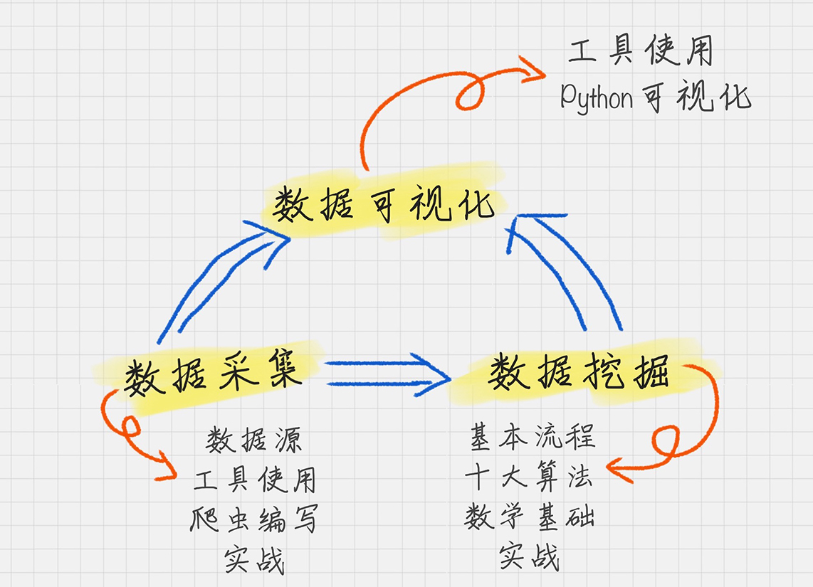
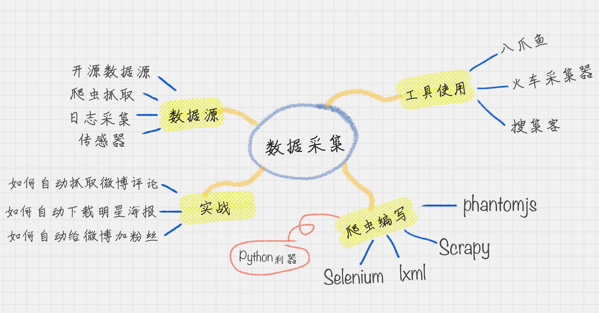
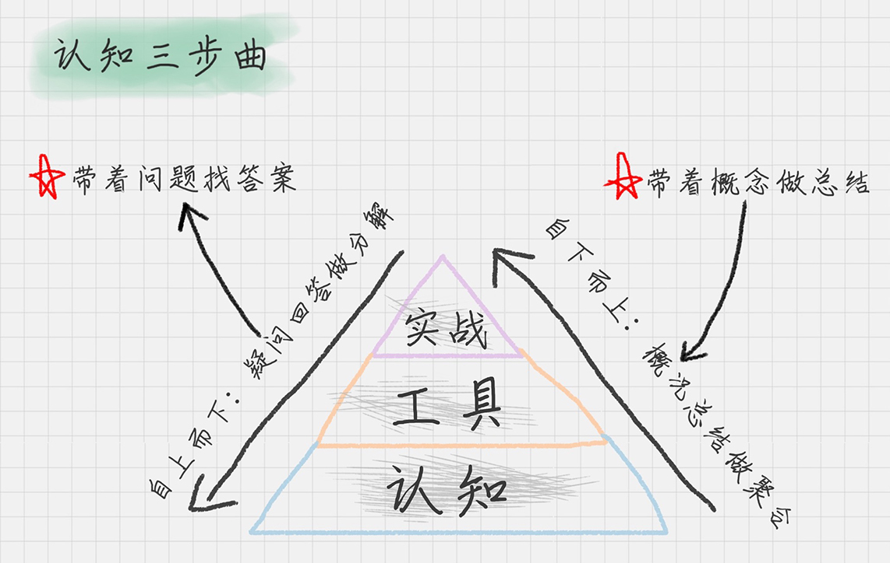
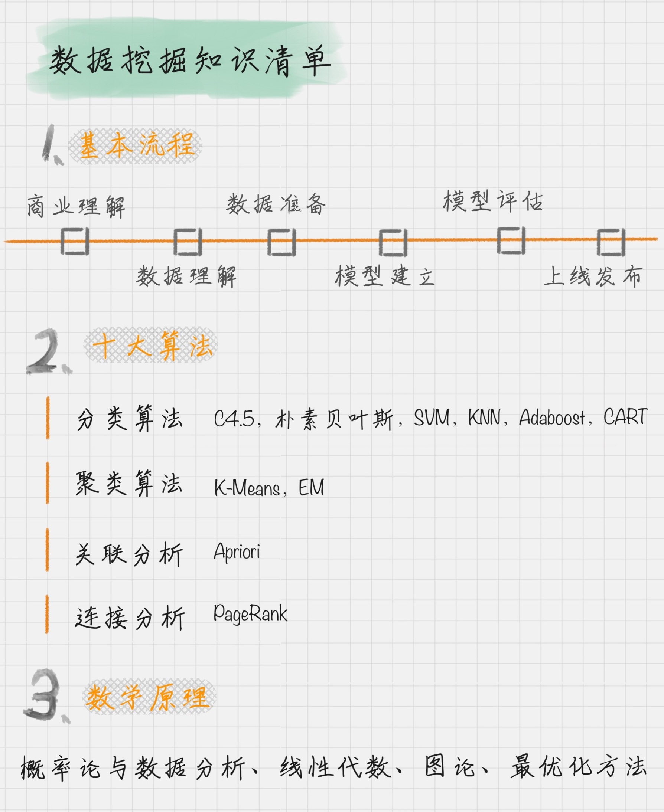

### 数据分析基础：

**Python工具库使用：**

* NumPy

* Pandas

* Matplotlib

**数据分析三个重要组成部分：**

1. 数据采集
2. 数据挖掘
3. 数据可视化

数据采集:

数据可视化

人与人最大的差别在于“认知”，所谓成长就是认知的升级。

我们只有把知识转化为自己的语言，它才真正变成了我们自己的东西。这个转换的过程，就是认知的过程。

**数据挖掘的基本流程：**

1. 商业理解：数据挖掘不是我们的目的，我们的目的是更好地帮助业务，所以第一步我们要从商业的角度理解项目需求，在这个基础上，再对数据挖掘的目标进行定义。

2. 数据理解：尝试收集部分数据，然后对数据进行探索，包括数据描述、数据质量验证等。这有助于你对收集的数据有个初步的认知。

3. 数据准备：开始收集数据，并对数据进行清洗、数据集成等操作，完成数据挖掘前的准备工作。

4. 模型建立：选择和应用各种数据挖掘模型，并进行优化，以便得到更好的分类结果。

5. 模型评估：对模型进行评价，并检查构建模型的每个步骤，确认模型是否实现了预定的商业目标。

6. 上线发布：模型的作用是从数据中找到金矿，也就是我们所说的“知识”，获得的知识需要转化成用户可以使用的方式，呈现的形式可以是一份报告，也可以是实现一个比较复杂的、可重复的数据挖掘过程。数据挖掘结果如果是日常运营的一部分，那么后续的监控和维护就会变得重要。

**数据挖掘的十大算法：**

* 分类算法：C4.5，朴素贝叶斯（Naive Bayes），SVM，KNN，Adaboost，CART

* 聚类算法：K-Means，EM
*  关联分析：Apriori
*  连接分析：PageRank

