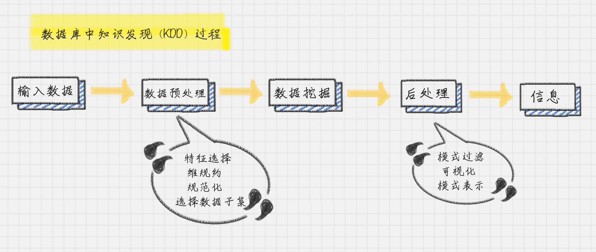

**元数据（MetaData）**：描述其它数据的数据，也称为“中介数据”。

**数据元（Data Element）**：就是最小数据单元。

比如一本图书的信息包括了书名、作者、出版社、ISBN、出版时间、页数和定价等多个属性的信息，我们就可以把这些属性定义成一套图书的元数据。

在图书这个元数据中，书名、作者、出版社就是数据元。

元数据最大的好处是使信息的描述和分类实现了结构化，让机器处理起来很方便。

数据挖掘的一个英文解释叫 Knowledge Discovery in Database，简称 **KDD**

**分类** ：就是通过训练集得到一个分类模型，然后用这个模型可以对其他数据进行分类。

**聚类**：人以群分，物以类聚。聚类就是将数据自动聚类成几个类别，聚到一起的相似度大，不在一起的差异性大。我们往往利用聚类来做数据划分。

**预测**：就是通过当前和历史数据来预测未来趋势，它可以更好地帮助我们识别机遇和风险。

**关联分析**：发现数据中的关联规则，它被广泛应用在购物篮分析，或事务数据分析中。

**数据预处理**中，我们会对数据进行几个处理步骤：数据清洗，数据集成，以及数据变换

**数据清洗**:主要是为了去除重复数据，去噪声（即干扰数据）以及填充缺失值。

**数据集成**：是将多个数据源中的数据存放在一个统一的数据存储中。

**数据变换**：就是将数据转换成适合数据挖掘的形式。比如，通过归一化将属性数据按照比例缩放，这样就可以将数值落入一个特定的区间内，比如 0~1 之间。

**数据后处理**是将模型预测的结果进一步处理后，再导出。比如在二分类问题中，一般能得到的是 0~1 之间的概率值，此时把数据以 0.5 为界限进行四舍五入就可以实现后处理。

**白话数据概念**

说了这么多概念，可能你还是觉得很抽象，我来打个比喻。

比如你认识了两个漂亮的女孩。**商业智能**会告诉你要追哪个？成功概率有多大？

**数据仓库**会说，我这里存储了这两个女孩的相关信息，你要吗？

其中每个女孩的数据都有单独的文件夹，里面有她们各自的姓名、生日、喜好和联系方式等，这些具体的信息就是**数据元**，加起来叫作**元数据**。

**数据挖掘**会帮助你确定追哪个女孩，并且整理好数据仓库，这里就可以使用到各种算法，帮你做决策了。

你可能会用到**分类算法**。御姐、萝莉、女王，她到底属于哪个分类？

如果认识的女孩太多了，多到你已经数不过来了，比如说 5 万人！你就可以使用**聚类算法**了，它帮你把这些女孩分成多个群组，比如 5 个组。然后再对每个群组的特性进行了解，进行决策。这样就把 5 万人的决策，转化成了 5 个组的决策。成功实现降维，大大提升了效率。如果你想知道这个女孩的闺蜜是谁，那么**关联分析算法**可以告诉你。

如果你的数据来源比较多，比如有很多朋友给你介绍女朋友，很多人都推荐了同一个，你就需要去重，这叫**数据清洗**；

为了方便记忆，你把不同朋友推荐的女孩信息合成一个，这叫**数据集成**；

有些数据渠道统计的体重的单位是公斤，有些是斤，你就需要将它们转换成同一个单位，这叫**数据变换**。
