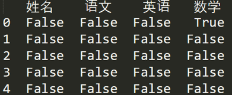

Pandas 可以是基于 NumPy 构建的含有更高级数据结构和分析能力的工具包。

#### 数据结构：Series 和 DataFrame

**Series 是个定长的字典序列**。说是定长是因为在存储的时候，相当于两个 ndarray，这也是和字典结构最大的不同。因为在字典的结构里，元素的个数是不固定的。

**Series 有两个基本属性：index 和 values**。在 Series 结构中，index 默认是 0,1,2,……递增的整数序列，当然我们也可以自己来指定索引，比如 index=[‘a’, ‘b’, ‘c’, ‘d’]。

```python
import pandas as pd
import numpy as np
from pandas import Series, DataFrame

x1 = Series([1,2,3,4])
x2 = Series(data=[1,2,3,4], index = ['a','b','c','d'])
print(x1)
print(x2)
```

输出结果为：

```
0    1
1    2
2    3
3    4
dtype: int64
a    1
b    2
c    3
d    4
dtype: int64
```

x1 中的 index 采用的是默认值，x2 中 index 进行了指定。

我们也可以采用字典的方式来创建 Series，比如：

```python
d = {'a':1, 'b':2, 'c':3, 'd':4}
x3 = Series(d)
print(x3)
```

输出结果为：

```
a    1
b    2
c    3
d    4
dtype: int64
```

**DataFrame 类型数据结构类似数据库表**

- 它包括了行索引和列索引，我们可以将 DataFrame 看成是由相同索引的 Series 组成的字典类型
  
  ```python
  data = {'Chinese': [66, 95, 93, 90,80],'English': [65, 85, 92, 88, 90],'Math': [30, 98, 96, 77, 90]}
  df1  = DataFrame(data)
  df2 = DataFrame(data, index=['Zhangfei', 'Guanyu','Zhaoyun','Caocao','Liuqing'])
  print(df1)
  print(df2)
  ```

输出结果：

```
   Chinese  English  Math
0       66       65    30
1       95       85    98
2       93       92    96
3       90       88    77
4       80       90    90
          Chinese  English  Math
Zhangfei       66       65    30
Guanyu         95       85    98
Zhaoyun        93       92    96
Caocao         90       88    77
Liuqing        80       90    90
```

#### 数据导入和输出：

Pandas 允许直接从 xlsx，csv 等文件中导入数据，也可以输出到 xlsx, csv 等文件。

```python
mport pandas as pdfrom pandas 
import Series, DataFrame
score = DataFrame(pd.read_excel('data.xlsx'))
score.to_excel('data1.xlsx')
print score
```

#### 数据清洗:

**1、删除 DataFrame 中的不必要的列或行**

Pandas 提供 drop() 函数来删除我们不想要的列或行：

```python
df2 = df2.drop(columns=['Chinese'])
```

```python
df2 = df2.drop(index=['ZhangFei'])
```

**2、重命名列名 columns，让列表名更容易识别**

如果想对 DataFrame 中的 columns 进行重命名，可以使用 rename(columns=new_names, inplace=True) 函数:

```python
df2.rename(columns={'Chinese': 'YuWen', 'English': 'Yingyu'}, inplace = True)
```

**3、去重复值**

使用 drop_duplicates() 就会自动把重复的行去掉:

```python
df = df.drop_duplicates() #去除重复行
```

**4、格式问题**

**更改数据格式**

我们可以使用 astype 函数来规范数据格式，比如我们把 Chinese 字段的值改成 str 类型，或者 int64 可以这么写：

```python
df2['Chinese'].astype('str') 
df2['Chinese'].astype(np.int64) 
```

**数据间的空格**

想要删除数据间的空格，可以使用 strip 函数：

```python
#删除左右两边空格
df2['Chinese']=df2['Chinese'].map(str.strip)
#删除左边空格
df2['Chinese']=df2['Chinese'].map(str.lstrip)
#删除右边空格
df2['Chinese']=df2['Chinese'].map(str.rstrip)
```

同样可以使用 strip 函数删除某个特殊的符号：

```python
df2['Chinese']=df2['Chinese'].str.strip('$')
```

**大小写转换**

直接使用 upper(), lower(), title() 函数，方法如下：

```python
#全部大写
df2.columns = df2.columns.str.upper()
#全部小写
df2.columns = df2.columns.str.lower()
#首字母大写
df2.columns = df2.columns.str.title()
```

**查找空值**

使用 Pandas 中的 isnull 函数进行查找空值。

如果我们想看下哪个地方存在空值 NaN，可以针对数据表 df 进行 df.isnull()：



如果我想知道哪列存在空值，可以使用 df.isnull().any():


**使用 apply 函数对数据进行清洗：**

比如我们想对 name 列的数值都进行大写转化可以用：

```python
df['name'] = df['name'].apply(str.upper)
```

我们也可以定义个函数，在 apply 中进行使用:

```python
def double_df(x):
           return 2*x
df1[u'语文'] = df1[u'语文'].apply(double_df)
```

#### 数据统计：


**数据表合并**

两个 DataFrame 数据表的合并使用的是 merge() 函数，有下面 5 种形式：

**1、 基于指定列进行连接：**

```python
df1 = DataFrame({'name':['ZhangFei', 'GuanYu', 'a', 'b', 'c'], 'data1':range(5)})
df2 = DataFrame({'name':['ZhangFei', 'GuanYu', 'A', 'B', 'C'], 'data2':range(5)})

df3 = pd.merge(df1, df2, on='name')
```

输出：

```
       name  data1  data2
0  ZhangFei      0      0
1    GuanYu      1      1
```

**2、inner 内连接:**

inner 内链接是 merge 合并的默认情况，inner 内连接其实也就是键的交集，在这里 df1, df2 相同的键是 name，所以是基于 name 字段做的连接：

```python
df3 = pd.merge(df1, df2, how='inner')
```

输出：

```
       name  data1  data2
0  ZhangFei      0      0
1    GuanYu      1      1
```

**3、left 左连接:**

左连接是以第一个 DataFrame 为主进行的连接，第二个 DataFrame 作为补充：

```python
df3 = pd.merge(df1, df2, how='left')
print(df3)
```

输出：

```
       name  data1  data2
0  ZhangFei      0    0.0
1    GuanYu      1    1.0
2         a      2    NaN
3         b      3    NaN
4         c      4    NaN
```

**4、right 右连接:**

右连接是以第二个 DataFrame 为主进行的连接，第一个 DataFrame 作为补充：

```python
df3 = pd.merge(df1, df2, how='right')
print(df3)
```

输出：

```
       name  data1  data2
0  ZhangFei    0.0      0
1    GuanYu    1.0      1
2         A    NaN      2
3         B    NaN      3
4         C    NaN      4
```

**5、outer 外连接:**

外连接相当于求两个 DataFrame 的并集:

```
df3 = pd.merge(df1, df2, how='outer')
print(df3)
```

输出：

```
       name  data1  data2
0  ZhangFei    0.0    0.0
1    GuanYu    1.0    1.0
2         a    2.0    NaN
3         b    3.0    NaN
4         c    4.0    NaN
5         A    NaN    2.0
6         B    NaN    3.0
7         C    NaN    4.0
```

#### 如何用 SQL 方式打开 Pandas

Pandas 的 DataFrame 数据类型可以让我们像处理数据表一样进行操作，比如数据表的增删改查，都可以用 Pandas 工具来完成。

在 Python 里可以直接使用 SQL 语句来操作 Pandas。

pandasql 中的主要函数是 sqldf，它接收两个参数：一个 SQL 查询语句，还有一组环境变量 globals() 或 locals()：

```python
from pandasql import sqldf, load_meat, load_births
df1 = DataFrame({'name':['ZhangFei', 'GuanYu', 'a', 'b', 'c'], 'data1':range(5)})
pysqldf = lambda sql: sqldf(sql, globals())
sql = "select * from df1 where name ='ZhangFei'"
print(pysqldf(sql))
```

输出：

```
       name  data1
0  ZhangFei      0
```

#### 总结：


