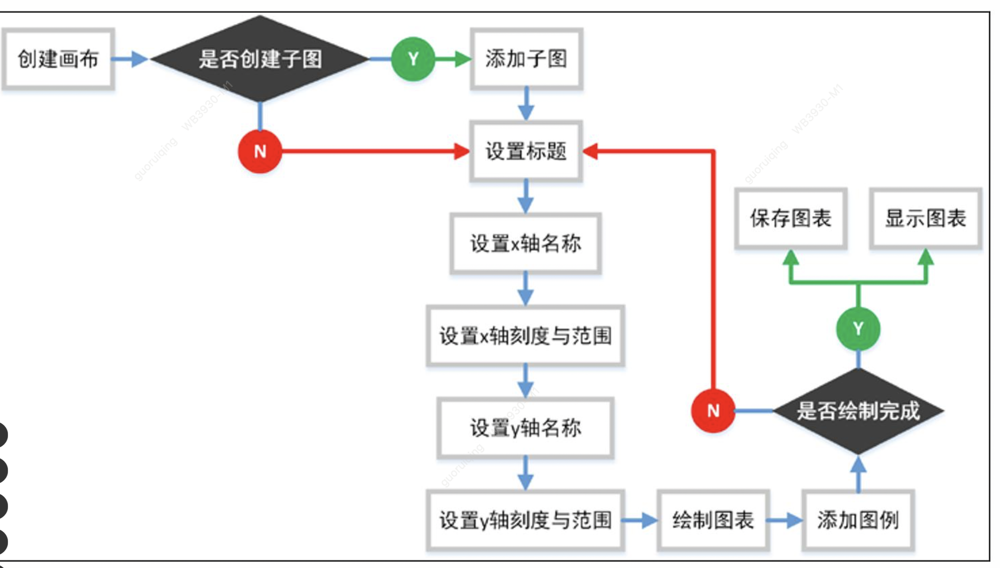

###大纲：

* pyplot模块的基本使用
* 创建画布与子图
* 绘制图像的保存与显示
* 绘制条形图
* 绘制折线图
* 绘制散点图
* 绘制饼图
* 绘制箱线图
* 绘制3D图


#### pyplot模块的基本使用

**pyplot子模块绘图流程：**




**条形图：**

条形图又叫作直方图，是一种以长方形的长度为变量的统计图表。

该图表分为水平与纵向两种，多数用于比较多个项目分类的数据大小，通过该图表可以比较直观地看出每个项目分类的分布状态。

使用pyplot子模块绘制条形图时，需要调用pyplot.bar()函数来实现。

```python
matplotlib.pyplot.bar(x, height, width=0.8, bottom=None, *, align='center', data=None, **kwargs) 
```

参数说明：

* x: x轴的数据，一般采用arange()函数产生一个序列

* height: y轴的数据，也就是柱形图的高度，一般就是我们需要展示的数据

* width: 条形的宽度，可以设置范围在0~1的浮点类型，默认为0.8

* alpha: 条形图的透明度

* color: 条形图的颜色

* edgecolor: 条形边框的颜色

* linewidth: 条形边框的宽度 

  

```python
from matplotlib.backends.backend_qt5agg import FigureCanvasQTAgg as FigureCanvas
import matplotlib
import matplotlib.pyplot as plt

# 避免中文乱码
plt.rcParams["font.sans-serif"] = ["Arial Unicode MS"] # 用来正常显示中文标签
matplotlib.rcParams['axes.unicode_minus'] = False # 用来正常显示负号

#数据
num  = [9, 2, 44, 1, 1, 5, 11, 4, 23]  
press = ['水利水电','中国电力','人民邮电','北京大学','科技大学','吉林大学','机械工业','清华大学','电子工业']

#设置图标跨行跨列
plt.subplot2grid((12, 12),(1, 2), colspan=12, rowspan=10)
#从上往下画水平条形图
plt.barh(range(len(num)), num, height=0.3, color='r', alpha=0.8)
plt.yticks(range(len(num)), press)  #y轴出版社名称显示
plt.xlim(0, 100) #x轴的数量
plt.xlabel("比例")
plt.title('top 100 出版社')
for x, y in enumerate(num):
    plt.text(y + 0.1, x, '%s'%y + '%', va = 'center')
plt.show()

```

运行结果：


**垂直条形图：**

```python
bar = plt.bar(range(len(num)),num,color='r')
plt.xticks(range(len(num)), press)
plt.ylim(0,100)
plt.ylabel('比例')
plt.title('top 100 出版社')
for b in bar:
    height = b.get_height()
    plt.text(b.get_x() + b.get_width()/2,height+1,'%s' % str(height) + '%',ha='center',va='bottom')
    
plt.show() 
```

运行结果：


**折线图：**

折线图是利用直线将数据点连接起来所组成的图表。

折线图主要是通过y轴的数据坐标点，随着自变量x轴所有改变的数据（文本标签）进行直线的绘制。

折线图通常用于观察随着时间变化的趋势，例如最常见的股票走势图、商品价格变化等。

使用pyplot子模块绘制折线图时，直接调用pyplot.plot()函数绘制即可。

```python
matplotlib.pyplot.plot(*args, scalex=True, scaley=True, data=None, **kwargs) 
```

参数说明：

* x:  x轴数据，接受列表类型的数据
* y:  y轴数据，接受列表类型的数据
* linewidth: 绘制折线的宽度
* color：设置折线的颜色 
* linestyle：设置折现类型，默认为'-'
* marker：设置折线点点类型
* markerfacecolor：设置折线点实心颜色
* markersize：设置折线点的大小


```python
x = ['1','2','3','4','5','6','7','8','9','10']
y = [71.0, 94.1, 47.1, 72.4, 86.1, 79.0, 71.0, 73.3, 55.0, 39.1]
plt.plot(x, y, linewidth=3, color='r', marker='o',markerfacecolor='blue',markersize=8)
plt.xlabel('排名')
plt.ylabel('价格')
plt.title('前10名价格走势图')
plt.grid()  #显示网格
plt.show()
```

运行结果：


**散点图:**

散点图又叫作散点分布图，是横向数据x与纵向数据y所构成的多个坐标点。

通过观察坐标点的分布情况，判断多种数据之间是否存在某种关联。

如果某一个点或者是几个点偏离大多数点时，可以迅速观察个别偏离点是否会对整个数据造成影响。

散点图通常用于比较跨类别的聚合数据。

使用pyplot子模块绘制散点图时，可以使用pyplot.scatter()函数来实现。

```python
    matplotlib.pyplot.scatter(x, y, s=None, c=None, marker=None, cmap=None, norm=None, vmin=None, 
vmax=None, alpha=None, linewidths=None, verts=None, edgecolors=None, *, data=None,
**kwargs) 
```

常用参数说明：

* x:  x轴数据，接受列表类型的数据
* y:  y轴数据，接受列表类型的数据
* s:  设置点的大小，当该参数设置为列表数据时，表示设置每个点的大小
* c：设置点的颜色或颜色列表，当该参数设置为列表数据时，表示设置每个点的颜色
* marker：设置绘制点的类型


创建一个显示a与b两组数据的散点图：

```
a = 2
#随机生成数据a的坐标点
x = np.random.randn(a)
y = np.random.randn(a)

b = 20
#随机生成数据b的坐标点
x_b = np.random.randn(b)
y_b = np.random.randn(b)

plt.scatter(x,y,c='r',marker='>')
plt.scatter(x_b,y_b,c='b',marker='o')
plt.legend(['数据a','数据b'])
plt.show()
```

运行结果：


**饼图：**

饼图的英文学名叫作Sector Graph，也叫作Pie Graph。

饼图就是将各项大小的数据按照比例显示在一个“饼”形的图表当中。

图表中的每个数据项具有唯一的颜色或图案并且在图表的图例中表示。

饼图中的每项数据显示为占整个饼图的百分比。

例如，查看某个行业中每个公司占据市场的份额比例就可以通过饼图显示。

使用pyplot子模块绘制饼图时，可以使用pyplot.pie()函数来实现。该函数的语法格式如下：

```python
    matplotlib.pyplot.pie(x, explode=None, labels=None, colors=None, autopct=None, pctdistance 
=0.6, shadow= False, labeldistance=1.1, startangle=None, radius=None, counterclock=True, 
wedgeprops=None, textprops=None, center=(0, 0), frame=False, rotatelabels=False, *, data= 
None) 
```

参数说明：

* x: 绘制饼图的数据，也就是饼图中每个部分的大小
* explode: 饼图突出部分
* label: 饼图各部分标签文本
* labeldistance: 饼图标签文本距离圆心的位置，1.1表示1.1倍半径
* autopct: 饼图内文本的显示方式
* shadow: 是否设置阴影
* startangle: 起始角度，默认从0开始逆时针转
* pctdistance: 设置饼图内文本与圆心的距离
* colors: 设置饼图内各部分颜色

```python
label_list = ['好评','中差评']
size = [79,21]
color = ['lightblue','red']
explode = [0.05, 0]
plt.pie(size,colors=color,labels=label_list,explode=explode,labeldistance=1.1,autopct="%1.1f%%",shadow=True, startangle=0, pctdistance=0.6)
plt.axis("equal") #设置横轴和纵轴大小相等，这样饼才是圆的
plt.title("title", fontsize=12)
plt.legend()  #显示图例
plt.show()
```

运行结果：


**箱体图：**

箱形图英文名叫作Box plot，又称为盒须图、盒式图以及箱线图。

它是一种可以看出一组数据分散情况的统计图，因形状如箱子而得名。

箱形图可以显示出一组数据的最大值、最小值、中位数以及上四分位数和下四分位数，偶尔还会出现数据中的异常值。

使用pyplot子模块绘制箱形图时，可以使用pyplot.boxplot()函数来实现。

```python
    matplotlib.pyplot.boxplot(x, notch=None, sym=None, vert=None, whis=None, positions=None, 
widths=None, patch_artist=None, bootstrap=None, usermedians=None, conf_intervals=None, 
meanline=None, showmeans=None, showcaps=None, showbox=None, showfliers=None, boxprops=None, 
labels=None, flierprops=None, medianprops= None, meanprops=None, capprops=None, whiskerprops= 
None, manage_xticks=True, autorange=False, zorder= None, *, data=None) 
```

参数说明：

* x: 设置要绘制箱形图的数据
* notch: 设置箱形图是否是凹口的形式显示
* sym: 设置异常点的形状
* vert: 设置箱形图是横向还是纵向
* positions: 设置箱形图的位置
* widths: 设置箱形图的宽度
* patch_artist: 设置是否填充箱体颜色
* showcaps: 设置是否显示最大值与最小值的横线
* showfliers: 设置是否显示异常值
* boxprops: 设置箱体的属性，比如框色、填充色等
* medianprops: 设置中位数属性，如线的颜色、粗细等
* capprops: 设置最大值与最小值横线属性，如线的颜色、粗细等

```python
data = [[100, 500, 300, 400, 800],[80, 150, 340, 210, 500]]
labels = ['工厂A', '工厂B']
plt.boxplot(data,labels=labels)
plt.title('箱体图')
plt.show()
```

运行结果：


**多面板图表:**

多面板图表就是将多个图表显示在一个图表窗体当中。

**一、添加子图**

实现添加子图时，需要先调用pyplot.figure()函数创建图形画布对象，

然后调用figure.add_subplot()函数向图形画布中添加需要显示的子图。

每添加一个子图时就需要调用一次figure.add_subplot()函数。

```
x = np.arange(0,50)
fig = plt.figure(figsize=(6,4))  #设置图形画布大小
x1 = fig.add_subplot(211)   #添加子图x1, 211代表2行1列
plt.title('子图x1')
x1.plot(x,x)
x2 = fig.add_subplot(212)
plt.title('子图x2')
x2.plot(x, x ** 2)
plt.show()
```

运行结果：


**2、添加多个子图**

可以通过调用pyplot.subplots()函数实现一次创建多个子图。

```python
x = np.arange(1, 50)
fig, axes = plt.subplots(2, 2)
x1 = axes[0,0]
x2 = axes[0,1]
x3 = axes[1,0]
x4 = axes[1,1]
x1.plot(x,x)
x2.plot(x,-x)
x3.plot(x,x ** 2)
x4.plot(x, np.log(x))
plt.show()
```

运行结果：


**3、添加子区域：**

添加子区域是指，在一个图形画布的任意位置添加一个新的区域，并且该区域的大小可以任意设置。

添加子区域时需要先调用pyplot.figure()函数创建图形画布对象，然后再调用figure.add_axes()函数实现在图形画布中添加子区域。

在设置子区域大小时需要在add_axes()函数中分别设置［left、bottom、width、height］列表类型的参数，

例如参数为［0.1,0.1,0.8,0.8］代表figure图形画布的百分比，

0.1表示从figure图形画布的10%的位置开始绘制，

0.8表示子区域的宽度与高度是figure图形画布的80%。

```
fig = plt.figure()
x = [1,2,3,4,5,6,7,8]
y = [1,3,2,1,6,2,4,6]
#设置子区域x1绘制位置与大小
left, bottom, width, height = 0.1, 0.1, 0.8, 0.8
#添加子区域x1
x1 = fig.add_axes([left, bottom, width, height])
x1.plot(x, y, 'b')
x1.set_title('子图x1')

#设置子区域x2绘制位置与大小
left, bottom, width, height = 0.2, 0.5, 0.25, 0.25
#添加子区域x2
x2 = fig.add_axes([left, bottom, width, height])
x2.plot(x, y, 'y')
x2.set_title('子图x2')
plt.show()
```

运行结果：

